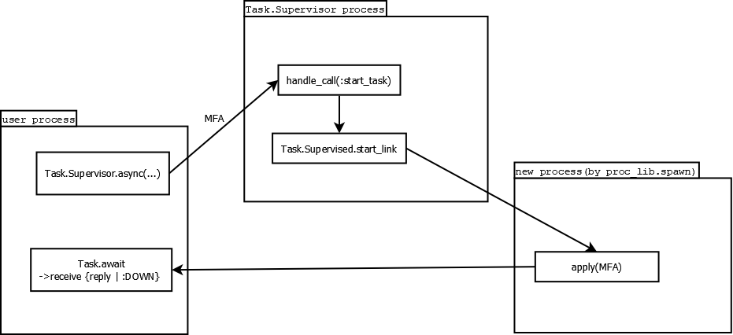

# 官方例子解读
### 从[Elixir分布式官方第一个例子]开始

在`foo@computer-name`中运行一个函数

```elixir
iex> Node.spawn_link :"foo@computer-name", fn -> Hello.world end
#PID<9014.59.0>
hello world
```

Elixir的Node实现里仅仅是调用erlang的spawn而已

```elixir
@spec spawn_link(t, (() -> any)) :: pid
def spawn_link(node, fun) do
  :erlang.spawn_link(node, fun)
end
```

erlang文档：

```erlang
spawn_link(Node, Module, Function, Args) -> pid()
    Types
        Node = node()
        Module = module()
        Function = atom()
        Args = [term()]
```

> Returns the process identifier (pid) of a new process started by the application of Module:Function to Args on Node. A link is created between the calling process and the new process, atomically. If Node does not exist, a useless pid is returned and an exit signal with reason noconnection is sent to the calling process. Otherwise works like spawn/3.

### :erlang.spawn干了啥

**此节非基于erlang源码，而是纯猜:)**

* 编译代码

这个是运行前的，其实不关spawn的事。假设用[Code.compile_string]举例编译匿名函数。

```Elixir
src="""
defmodule MyMod do
  def hi do IO.puts "hi" end
  end
"""

[{mod, obj_code}] = Code.compile_string(src)
```

因为Elixir是编译成erlang的字节码，所以编译以后和erlang是一套东西了。

* 加载字节码

因为要在远程执行，那必然要加载到远程节点的。 OTP不会帮你把依赖自动都加载到远程。erlang vm上有一个叫[code server]的带状态的服务,管理所有代码的加载。

```elixir
Node.spawn :"foo@computre-name", fn -> MyMod.hi() end #报错，找不到MyMod
Node.spawn :"foo@computer-name", fn -> :code.load_binary(mod, 'nofile', obj_code) end
```

* 执行

```elixir
#远程已经加载了MyMod依赖，此时可以执行成功。同样eval_string也可以成功
Node.spawn :"foo@computre-name", fn -> MyMod.hi() end
Node.spawn :"foo@computre-name", fn -> Code.eval_string("MyMod.hi()") end
```

此时会在当前控制台打印`hi`。如果没有前面的`:code.load_binary`，`Code.eval_string`是不能执行成功的。

并且此时如果在`foo`节点控制台直接运行`MyMod.hi()`，也是可以正常运行的。

### 运行环境

我们发现在远程运行的`IO.puts`其实会打印到本地控制台，那其他资源如何？ 我们来试试文件系统

```Elixir
>File.mkdir("__tmp")
>File.exists?("__tmp")
true
>Node.spawn :"foo@computre-name", fn -> IO.puts(File.exists?("__tmp")) end
false
```

所以文件系统还是每个节点自己用自己的。包括如果你要加载nif的so(C语言实现的erlang模块),因为你编译erlang的时候nif是不会被转成字节码的，所以需要远程机器上有这个so文件，当然我们可以通过远程函数直接拷贝本机的so过去，只要知道远程节点的C环境。

### [Elixir分布式官方第二个例子]

```elixir
iex> task = Task.Supervisor.async {KV.RouterTasks, :"foo@computer-name"}, fn ->
...>   {:ok, node()}
...> end
%Task{owner: #PID<0.122.0>, pid: #PID<12467.88.0>, ref: #Reference<0.0.0.400>}
iex> Task.await(task)
{:ok, :"foo@computer-name"}
```

[Task.Supervisor]是一个用于监视动态任务的`Supervisor`。`supervision tree`是一颗监视树，一层层的`Supervisor`可以监视自己的儿孙。官方文档中说了一堆`Task.Supervisor`本身这个特殊类型的`Supervisor`需要被放在一颗树里。反正跟我们现在说的分布式没直接关系，不要晕即可。

第一行中`{KV.RouterTasks, :"foo@computer-name"}`前者是之前注册（`{Task.Supervisor, name: KV.RouterTasks}`）到监视树中`Supervisor`的名字，所以其实这个`KV.RouterTasks`是个`Task.Supervisor`类型的进程。（我这里说进程的类型，就是指这个进程能`receive`处理哪些消息）

很绕，抛开OTP的那些模式，用下图说明这个过程：



有两个点，第一是`Process.monitor(pid)`可以在当前进程监听`pid`退出状态，这样supervisor就知道远程Process有没有挂掉了。另一个是[proc_lib]这个erlang库，从分布式来讲好像和普通`spawn`并无本质区别。

所以`Task.Supervisor`就是给远程过程加了更多的监控和重启等控制。

### erlang.rpc

这个模块挺牛逼的，可以同步、异步调用远程函数，还可指定好几个远程节点一起调用函数。http://erlang.org/doc/man/rpc.html


[Elixir分布式官方第一个例子]: https://elixir-lang.org/getting-started/mix-otp/distributed-tasks-and-configuration.html
[Elixir分布式官方第二个例子]: https://elixir-lang.org/getting-started/mix-otp/distributed-tasks-and-configuration.html#distributed-tasks
[Code.compile_string]: https://hexdocs.pm/elixir/Code.html#compile_string/2
[code server]: http://erlang.org/doc/man/code.html
[Supervisor模式]: https://hexdocs.pm/elixir/Supervisor.html
[Task.Supervisor]: https://hexdocs.pm/elixir/Task.Supervisor.html
[proc_lib]: http://erlang.org/doc/man/proc_lib.html
